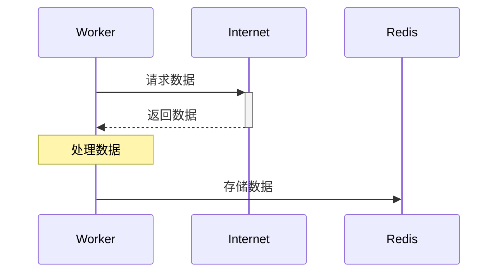
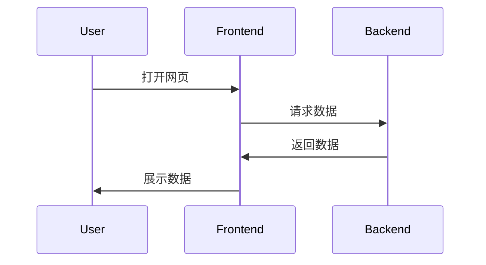

## 时序图

### 数据刷新时序图

```mermaid
sequenceDiagram
    participant W as Worker
    participant I as Internet
    participant DB as Redis

    W->>+I: 请求数据
    I-->>-W: 返回数据
    Note over W: 处理数据
    W->>DB: 存储数据
```

### web页面时序图

```mermaid
sequenceDiagram
    participant U as User
    participant F as Frontend
    participant B as Backend

    U->>F: 打开网页
    F->>B: 请求数据
    B->>F: 返回数据
    F->>U: 展示数据
```
